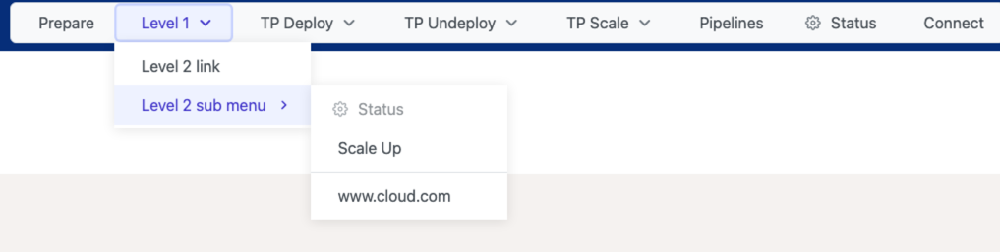
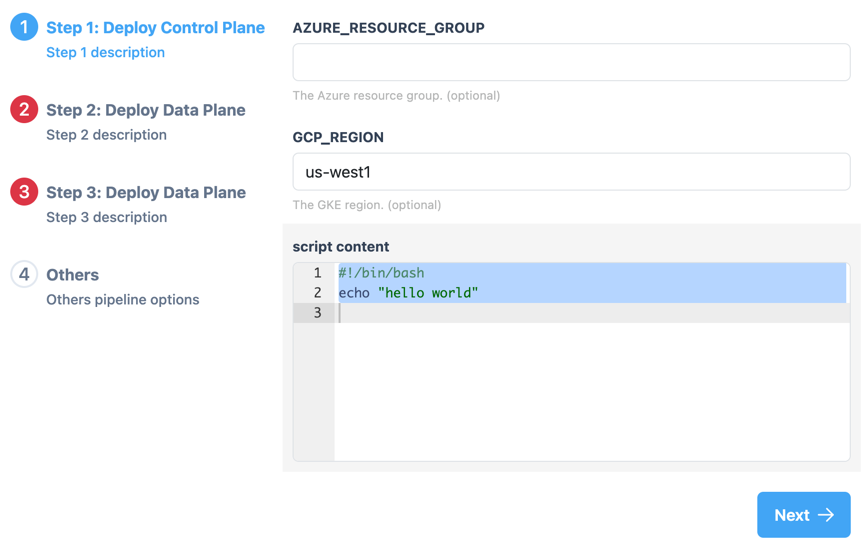

# Platform Provisioner UI by TIBCO®

[](LICENSE)
[](https://github.com/TIBCOSoftware/platform-provisioner-ui/actions/workflows/docker-image-ghcr-build-push.yml)

A web-based management interface for the [Platform Provisioner](https://github.com/TIBCOSoftware/platform-provisioner) by TIBCO®. Provides recipe management capabilities for platform provisioning and operational tasks. The UI is fully customizable and can be extended to fit your needs. By default, the UI is fit for the [TIBCO Platform](https://www.tibco.com/platform).

## Screenshots

| Pipeline Management | Recipe Options |
|---|---|
|  |  |

## Features

- **Recipe Management** — Create, edit, and deploy provisioning recipes through an intuitive UI
- **Kubernetes Integration** — Direct integration with Kubernetes API for ConfigMap/Secret management and pipeline execution
- **Multi-Cloud Provisioning** — Zero-trust provisioning system for multi-cloud environments
- **Self-Service** — Enable developers to provision infrastructure and applications on demand
- **SAML Authentication** — Enterprise SSO support with SAML-based authentication
- **MCP Server** — [Model Context Protocol](https://modelcontextprotocol.io/) server for AI-assisted pipeline management via Claude Code ([details](docs/ai/mcp.md))
- **Theme Support** — Multiple built-in color themes

## Use Cases

- Developer/DevOps engineers managing recipes for platform provisioning
- SRE teams managing recipes for operational tasks
- Platform teams providing self-service provisioning for developers
- Dynamic infrastructure and application deployment on demand

## Getting Started

### Prerequisites

- Running Kubernetes cluster (Docker Desktop, GKE, EKS, etc.)
- [Platform Provisioner](https://github.com/TIBCOSoftware/platform-provisioner) deployed in the cluster

### Quick Start

```bash
export PIPELINE_GUI_SERVICE_PORT=8080
export PIPELINE_GUI_SERVICE_TYPE=LoadBalancer
/bin/bash -c "$(curl -fsSL https://raw.githubusercontent.com/TIBCOSoftware/platform-provisioner/main/dev/platform-provisioner-install.sh)"
```

Access http://localhost:8080/ to see the UI.

### Local Development

```bash
cd provisioner-webui
npm install
npm run dev          # Start Vite dev server (port 5173)
npm run start:local  # Build and start with backend server
```

### Build & Deploy

```bash
# Validate (typecheck + build)
make typecheck build

# Deploy to local Kubernetes
make deploy-local

# Run E2E tests
make test-e2e
```

See the [provisioner-webui README](provisioner-webui/README.md) for detailed development instructions.

## MCP Server (Claude Code Integration)

The platform provisioner includes an [MCP](https://modelcontextprotocol.io/) server that allows Claude Code to manage recipes and pipelines directly. Pipeline runs created via MCP are labeled with the individual user's identity (e.g., `created-by: tao.peng`).

### Setup

1. Add the MCP server to Claude Code:
   ```bash
   # Staging
   claude mcp add --transport http --scope user tibco-platform-provisioner https://provisioner-staging.cic2.tibcocloud.com/mcp
   # Production
   claude mcp add --transport http --scope user tibco-platform-provisioner https://provisioner.cic2.tibcocloud.com/mcp
   ```

2. On first MCP tool call, Claude Code triggers OAuth — complete SAML SSO login in the browser.

3. Start using MCP tools in Claude Code:
   ```
   > list my pipeline runs
   > create a pipeline run using generic-runner for account gcp-123
   > check pipeline run status for generic-runner-gcp-123-1779289409753
   ```

### Available Tools

| Tool | Purpose |
|------|---------|
| `whoami` | Current user identity |
| `listAccounts` | Accessible accounts |
| `listPipelines` | Available pipeline templates |
| `listPipelineRuns` | Pipeline runs (default: current user) |
| `createPipelineRun` | Create and run a pipeline |
| `getPipelineRun` | Pipeline run details and status |
| `stopPipelineRun` / `deletePipelineRun` | Stop or delete a run |
| `loadRecipe` / `saveRecipe` | Load or save recipe configurations |
| `getTaskRunDetails` / `getContainerLog` | Task details and container logs |

See [docs/ai/mcp.md](docs/ai/mcp.md) for full documentation including authentication flow, token lifecycle, troubleshooting, and deployment guide.

## Tech Stack

- **Frontend**: Vue 3, TypeScript, PrimeVue, Vite
- **Backend**: Node.js, Koa
- **Testing**: Playwright (E2E), Vitest (Unit)
- **Deployment**: Docker, Helm, Kubernetes

## Contributing

See [CONTRIBUTING.md](CONTRIBUTING.md) for guidelines.

## Security

See [SECURITY.md](SECURITY.md) for reporting vulnerabilities.

## License

Copyright 2025 Cloud Software Group, Inc.

Licensed under the [Apache License, Version 2.0](LICENSE). See the LICENSE file for details.
