## YAML format description

The Platform Provisioner local menu configuration is defined in https://github.com/TIBCOSoftware/platform-provisioner/tree/main/charts/provisioner-config-local.
Please clone the `platform-provisioner` repo and navigate to the `charts/provisioner-config-local` directory.

### Config top menu items: menuContent.yaml
This file is used to define the menu items in the top navigation bar.

* Real data: `charts/provisioner-config-local/config/menuContent.yaml`

-  [X]  Support for unlimited level menus. `items:`
-  [X]  Support for menu label. `label: "Prepare"`
-  [X]  Support for internal link menu. `url: "/status"`
-  [X]  Support for external link menu. `url: "https://www.cloud.com"`
-  [X]  Support for Opens the link in a new tab. `target: "_blank"`
-  [X]  Support for a menu config file. `config: pp-prepare.yaml`
-  [X]  Support for an icon menu from `Primevue Icons` and `Bootstrap Icons`.
    - `icon: 'pi pi-cog'`, see the list in https://primevue.org/icons/#list
    - `icon: 'bi bi-airplane'`, see the list in https://icons.getbootstrap.com/ (from `3.1.0`)
-  [X]  Support for disabled menu. `disabled: true`
-  [X]  Support for separator menu. `separator: true`
-  [X]  Support for menu item with same `url` path but different config file. `/pipelines/helm-install?title=customTitle` (`title` will be the title of pipeline page)

The format is as follows:

```yaml
menuConfig:
  - label: "Prepare"  # menu label
    to: "/prepare"    # menu link
    config: pp-prepare.yaml    # page config file
  - label: "Level 1"
    items:  # if you need submenu, add items
      - label: "Level 2 link"       # level 2 label
        to: "/pipelines/cic2-multi-cluster-deletion"
        config: pp-cic2-multi-cluster-deletion.yaml
      - label: "Level 2 sub menu"   # level 2 sub menu label
        items:
          - label: "Status"         # level 3 sub menu label
            to: "/status"
            icon: 'pi pi-cog'       # see the primevue icon list in https://primevue.org/icons/#list
            disabled: true          # disable the menu item
          - label: "Scale Up"
            to: "/pipelines/cic2-scaleup"
            icon: 'bi bi-airplane'       # see the bootstrap icon list in https://icons.getbootstrap.com/
            config: pp-cic2-scaleup.yaml
          - label: "Standard EKS"
            to: "/pipelines/helm-install?title=customTitle1" # same to a path but different config file, title1 will be the pipeline page title (Low priority)
            config: pp-deploy-dp-eks.yaml          # if defined pipelineName, it will override the above-defined title (High priority)
          - label: "Standard AKS"
            to: "/pipelines/helm-install?title=customTitle2" # same to a path but different config file, title2 will be the pipeline page title (Low priority)
            config: pp-deploy-dp-aks.yaml          # if defined pipelineName, it will override the above-defined title (High priority)
          - separator: true         # Defines the item as a separator.
          - label: "www.cloud.com"
            url: "https://www.cloud.com"  # External link to navigate when item is clicked.
            target: "_blank"        # Opens the link in a new tab.
```

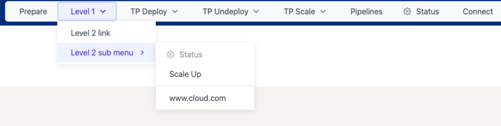

### Config pipeline input options: pp-*.yaml

This file is used to define the additional input options of the pipeline.

* Real data: `charts/provisioner-config-local/config/pp-*.yaml`
* Mock data: `provisioner-webui/server/data/pp-*.yaml`

-  [X]  Support for field mutual exclusion(will disable other fields if current field is set) from `3.1.2`.
  * Note: `disableOtherFieldsWhenSet` is support for any field type, it means when current filed is set, will disable other defined fields.
  * Note: `disableOtherFieldsWhenSet` is an array, the value is other filed reference, example: `["meta.fileContent", "networking.vpcs[1].cidrs"]`.
-  [X]  Support for file upload and base64 encode file content from `3.1.1`.
  * Note: default `accept` is empty, allow any file. accept value see the [HTML attribute: accept](https://developer.mozilla.org/en-US/docs/Web/HTML/Attributes/accept)
  * Note: default `fileSize` is 100, the unit is KB.
  * 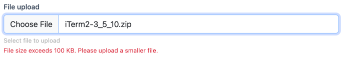
-  [X]  Support for group option fields from `3.1.0`.
      ```
      groups:
        - title: "Step 1: Deploy Control Plane"
          index: 1
          description: |
            Step 1 description
        - title: "Step 2: Deploy Data Plane"
          index: 2
          description: "Step 2 description"
        - title: "Step 3: Deploy Data Plane"
          index: 3
          description: "Step 3 description"
      options:
        - name: "pipeline field 1"
          groupIndex: 1
        - name: "pipeline field 2"
          groupIndex: 2
        - name: "pipeline field 3"
          groupIndex: 3
        - name: "pipeline field others"
          // no groupIndex item will be in the others group
      ```
   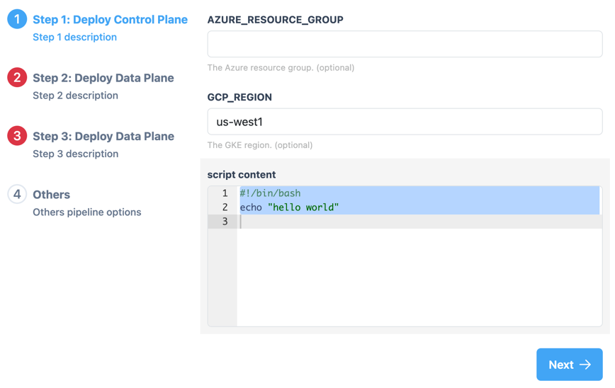
-  [X]  Support for define the title of the field. `name: "Field name"`
-  [X]  Support for different types of input fields. `guiType: input | checkbox | multiselect | radio | dropdown | textarea`
-  [X]  Support for different types of value. `type: string | number | boolean | array`
-  [X]  Support for input to be password. `guiType:input, type: password`
-  [X]  Support for string/array default value.
-  [X]  Support for reference to the JSON path. `reference: "networking.vpcs[1].identifier"`
-  [X]  Support for a test reference path. See the `Test reference path` button in the pipeline page.
-  [X]  Support for using a custom recipe to override the default value.
     ```
     recipe: |
       version: 2.0.0
     ```
-  [X]  Support for required attribute. `required: true`
-  [X]  Support for rich text editor for textarea field. `lang: "yaml"`
    * Note: default `lang` is `yaml`, see the [lang list](https://github.com/ajaxorg/ace/blob/v1.32.6/src/ext/modelist.js#L55)
    * Note: the value of the `lang` is the lowercase key of the `supportedModes` in the above link.
    * Example: `SH: ["sh|bash|^.bashrc"],`, the value of the `lang` is `sh`.

-  [X]  Support for field description, and description support for standard HTML tag only, for security reason, the HTML will be formatted by [DOMPurify](https://www.npmjs.com/package/dompurify).

    ```
    description: "This is a description of the field. <a href='https://www.cloud.com' target='_blank'>Cloud</a>"
    ```
-  [X]  Support for pipeline description, and description support for [vue3-markdown](https://vue-md.netlify.app/) only, see [example](images/description-markdown.png).

    ```
    description: |
      ### Markdown

      * Markdown is a lightweight markup language with plain-text-formatting syntax, created in 2004 by John Gruber with Aaron Swartz.
      * Markdown is often used to format readme files, for writing messages in online discussion forums, and to create rich text using a plain text editor.
      ```

| guiType                             | Code                                                                                                                                                                                                                                                                                                                                                                        | Example                                                           |
|:------------------------------------|:----------------------------------------------------------------------------------------------------------------------------------------------------------------------------------------------------------------------------------------------------------------------------------------------------------------------------------------------------------------------------|:------------------------------------------------------------------|
| input(required)                     | <pre>- name: "Installation Owner"<br/>  type: string<br>  guiType: input<br/>  required: true<br/>  reference: "meta.installationOwner"</pre>                                                                                                                                                                                                                               | 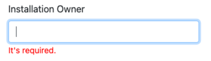 |
| input(password)                     | <pre>- name: "Installation Owner"<br/>  type: password<br>  guiType: input<br/>  required: false<br/>  reference: "meta.installationOwner"</pre>                                                                                                                                                                                                                            | 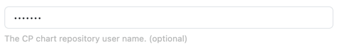 |
| input(description)                  | <pre style="width: 400px;width: 400px; white-space: pre-wrap; word-wrap: break-word; overflow-wrap: break-word;">- name: "Installation Owner"<br/>  type: string<br>  guiType: input<br/>  description: "This is a description. &lt;a href='#'&gt;Cloud&lt;/a&gt;"<br/>  reference: "meta.installationOwner"</pre>                                                          | 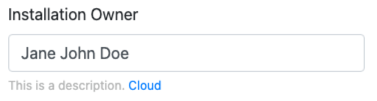                   |
| checkbox                            | <pre>- name: "Is connect cic1"<br/>  type: boolean<br>  guiType: checkbox<br/>  reference: "installation.tibco.connectCic1"</pre>                                                                                                                                                                                                                                           | 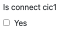                           |
| checkbox<br/>(disable other fields) | <pre>- name: "Is connect cic1"<br/>  type: boolean<br>  guiType: checkbox<br/>  reference: "installation.tibco.connectCic1"<br/>  disableOtherFieldsWhenSet: ["meta.fileContent", "networking.vpcs[1].cidrs"]</pre>                                                                                                                                                         | 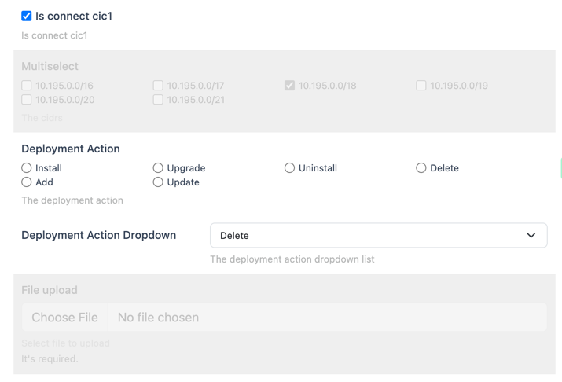      |
| textarea                            | <pre>- name: "Description<br/>  cic-gatekeeper:\n    enabled: false"<br/>  type: string<br>  guiType: textarea<br/>  lang: yaml<br/>  reference: "helmCharts[0].values.content"</pre>                                                                                                                                                                                       | 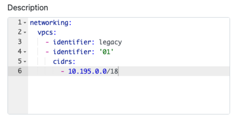                           |
| multiselect                         | <pre>- name: "Multiselect<br/>  labels:<br/>    - "10.195.0.0/16"<br/>    - "10.195.0.0/17"<br/>  values:<br/>    - "10.195.0.0/16"<br/>    - "10.195.0.0/17"<br/>  type: array<br/>  guiType: multiselect<br/>  reference: "networking.vpcs[1].cidrs"</pre>                                                                                                                | 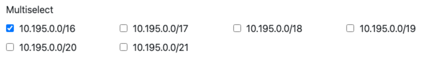                     |
| radio                               | <pre>- name: "Radio<br/>  labels:<br/>    - "Install"<br/>    - "Upgrade"<br/>  values:<br/>    - "install"<br/>    - "upgrade"<br/>  type: string<br/>  guiType: radio<br/>  reference: "networking.vpcs[1].cidrs"</pre>                                                                                                                                                   | 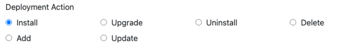                                 |
| dropdown                            | <pre>- name: "Flag timeout"<br/>  type: string<br/>  guiType: dropdown<br/>  required: true<br/>  labels:<br/>    - "30 minutes"<br/>    - "1 hours"<br/>    - "2 hours"<br/>    - "4 hours"<br/>  values:<br/>    - "30m"<br/>    - "1h"<br/>    - "2h"<br/>    - "4h"<br/>  reference: "helmCharts[0].flags.timeout"<br/>  description: "flags timeout description"</pre> | 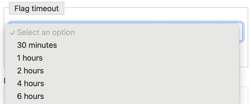                              |
| file                                | <pre>- name: "File upload"<br/>  type: string<br/>  guiType: file<br/>  required: true<br/>  description: "Select file to upload"<br/>  accept: ".zip,.tar,.gz"<br/>  fileSize: 100<br/>  reference: "meta.fileContent"</pre>                                                                                                                                               |                                    |

The format is as follows:

```yaml
pipelineName: "Title of the pipeline"   # The title of the pipeline
description: |                          # The description of the pipeline, support for Markdown
  This pipeline will be used for TIBCO Control Plane SaaS deployment. (None CIC2)
  This pipeline will deploy latest version of Control Plane. The recipe is located at [link](https://github.com/tibco/cicinfra-devops/blob/main/recipes/cp-platform-dev/ControlPlane/environments/cp-recipes/pp-deploy-cp-core-all-charts.yaml)
  The pipeline will deploy the following components:
  * platform-bootstrap
  * platform-base
options:
  - name: "Field name"              # The name of the field
    type: string                    # The type of the field value. Support for: string | number | boolean
    guiType: input                  # The type of the input field. Support for: input | checkbox
    reference: "meta.installationOwner"  # reference to the JSON path, the value will be the default value
  - name: "clusters[0].nodeGroups[0].initialCount"
    type: number
    guiType: input
    reference: "clusters[0].nodeGroups[0].initialCount"
  - name: "Is connect cic1"
    type: boolean
    guiType: checkbox
    reference: "installation.tibco.connectCic1"
    disableOtherFieldsWhenSet: ["meta.fileContent", "networking.vpcs[1].cidrs"]
  - name: "Networking vpcs identifier"
    type: string
    guiType: input
    reference: "networking.vpcs[1].identifier"
  - name: "networking.vpcs[1].cidrs"
    labels:
      - "10.195.0.0/16"
      - "10.195.0.0/17"
      - "10.195.0.0/18"
      - "10.195.0.0/19"
      - "10.195.0.0/20"
      - "10.195.0.0/21"
    values:
      - "10.195.0.0/16"
      - "10.195.0.0/17"
      - "10.195.0.0/18"
      - "10.195.0.0/19"
      - "10.195.0.0/20"
      - "10.195.0.0/21"
    type: array
    guiType: multiselect
    reference: "networking.vpcs[1].cidrs"
  - name: "Deployment Action"
    type: string
    guiType: radio
    labels:
      - "Install"
      - "Upgrade"
      - "Uninstall"
      - "Delete"
      - "Add"
      - "Update"
    values:
      - "install"
      - "upgrade"
      - "uninstall"
      - "delete"
      - "add"
      - "update"
    reference: "meta.deploymentAction"
  - name: "Flag timeout"
    type: string
    guiType: dropdown
    required: true
    labels:
      - "30 minutes"
      - "1 hours"
      - "2 hours"
      - "4 hours"
    values:
      - "30m"
      - "1h"
      - "2h"
      - "4h"
    reference: "helmCharts[0].flags.timeout"
    description: "flags timeout description"
  - name: "File upload"
    type: string
    required: true
    description: "Select file to upload"
    accept: ".zip,.tar,.gz"
    fileSize: 100
    guiType: file
    reference: "meta.fileContent"
  - name: "helmCharts[0].values.content"
    type: string
    guiType: textarea
    reference: "helmCharts[0].values.content"
```
